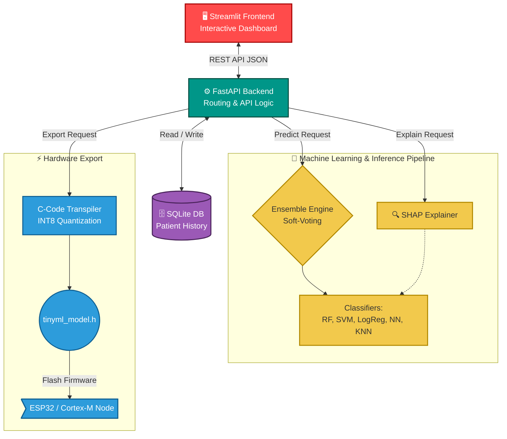

# TinyML Heart Health Monitoring Dashboard

A production-ready application for real-time heart health analytics, ensemble prediction modeling, and automated C-code transpilation for resource-constrained embedded systems.

**Live Environments:**
- 🖥️ **Frontend UI:** [Streamlit Cloud](https://tinyml-heart-health-monitoring-dashboard-8xqogy2hibtlayt7popvs.streamlit.app/)
- ⚙️ **Backend API:** [Hugging Face Spaces](https://huggingface.co/spaces/IDKHowToCodeFr/tinyml-backend)

## Overview

This application bridges the gap between high-level cloud machine learning and low-level embedded hardware. It evaluates patient vitals using an ensemble of classifiers, provides strict clinical explainability, and compresses these Python-trained models into raw C-code ready to be flashed onto IoT devices.

### Key Engineering Features

- **Edge Computing & TinyML**: Transpiles complex Scikit-Learn models into highly optimized, dependency-free **C-code headers**. This allows predictive intelligence to be deployed directly to the edge, enabling offline, ultra-low latency, and privacy-preserving inference.
- **INT8 Quantization Engine**: Mathematically scales 64-bit floating-point weights down to 8-bit integers, effectively shrinking the flash memory payload by **~75%** for resource-constrained microcontrollers.
- **Dynamic Hardware Profiling**: The deployment suite actively simulates target hardware (e.g., *ESP32, Arduino Nano 33 BLE, Raspberry Pi Pico*) to calculate expected inference latency metrics (in µs) and final byte-size footprints prior to flashing.
- **Interpretable AI (SHAP)**: Solves the medical "black box" concern by generating real-time SHAP feature impact analyses. This visualization proves exactly *why* the AI assigned a specific risk score based on individual patient variables.
- **Soft-Voting Ensemble**: Rather than relying on a single algorithm, the backend aggregates outputs across five independent models (Random Forest, SVM, KNN, Logistic Regression, Neural Network) to output the highest-confidence predictions.

## Architecture

The project follows a decoupled, modular design pattern separating the client interface from the ML processing pipeline.



### Modular Repository Structure

```text
TinyML-Dashboard/
├── backend/               # FastAPI server, ML pipelines, SQLite API, C-code logic
├── frontend/              # Streamlit UI mapping, Plotly charts, web routing
├── model/                 # Local cache of serialized SciKit-Learn .pkl weights
├── data/                  # Patient cohort CSVs for MLOps retraining pipelines
├── tests/                 # Full PyTest suite for backend continuous integration
├── .github/workflows/     # CI/CD actions for auto-syncing to Hugging Face
└── docker-compose.yml     # Orchestration spec for local containerized deployment
```

## Setup & Installation

### Requirements
- Python 3.9 or higher
- Git

### Installation Steps

1. **Clone the repository:**
```bash
git clone https://github.com/IDKHowToCodeFR/TinyML-Heart-Health-Monitoring-Dashboard.git
cd TinyML-Heart-Health-Monitoring-Dashboard
```

2. **Install global requirements:**
```bash
pip install -r requirements.txt
pip install -r backend/requirements.txt
pip install -r frontend/requirements.txt
```

3. **Train the baseline local `.pkl` models (Required on first run):**
```bash
cd backend
python models.py 
cd ..
```

## Usage

### 🚀 Quick Start (Windows)
We've bundled an automated startup script that boots both environments natively:
```bash
run.bat
```

### 🐳 Docker Deployment
To avoid local python pathing issues, you can spin up the application via Docker Compose:
```bash
docker-compose up --build
```
*The Streamlit interface will bind automatically to `http://localhost:8501`, connecting directly to the internal API.*

### 🛠️ Manual Startup
If you prefer running the stack manually in separate terminal instances:

**Start the Backend:**
```bash
cd backend
uvicorn main:app --host 0.0.0.0 --port 8000
```
**Start the Frontend:**
```bash
cd frontend
streamlit run Home.py
```

## Development & Automation

### API Documentation
FastAPI serves auto-generated interactive documentation. While the backend is running, you can hit the endpoints directly at:
- **Swagger UI:** `http://localhost:8000/docs`
- **ReDoc:** `http://localhost:8000/redoc`

### CI/CD Pipelines
The project utilizes GitHub actions natively located in `.github/workflows/`:
1. **PyTest Validation**: Verifies endpoint data sanitization and schema parameters immediately on Push/Pull Requests.
2. **Hugging Face Sync**: Auto-deploys `main` branch updates precisely to the Hugging Face Space Docker container ensuring CI/CD alignment.

## Support & License
This project is licensed under the MIT License. Designed as a scalable, educational, and fully interpretable Edge-based Machine Learning architecture.
