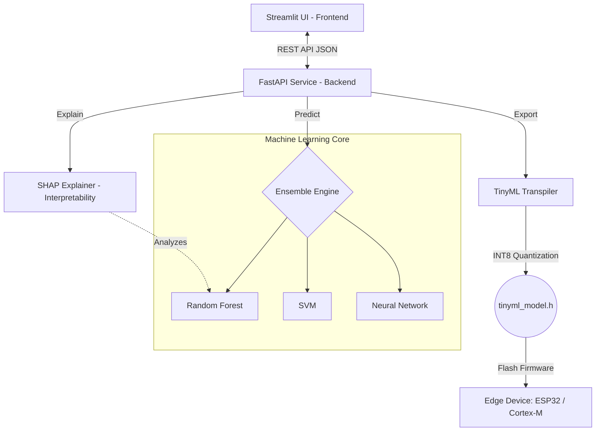

# TinyML Heart Health Monitoring Dashboard


A scalable, end-to-end Machine Learning ecosystem designed to provide heart health analytics, ensemble modeling predictions, and Edge AI deployment capabilities for resource-constrained microcontrollers.

---

## 🏗️ System Architecture

The system follows a separated frontend/backend architecture, enabling scaling flexibility and clean separation of concerns.



---

## ✨ Key Technical Features

### 1. TinyML Edge Deployment & INT8 Quantization 📉
The core value proposition is executing model inference offline on devices like the ESP32 and ARM Cortex-M. The backend transpiler natively parses trained models (Logistic Regression, Support Vector Machines, Neural Networks, K-Nearest Neighbors) into portable `stdint.h` C-code binaries.

Crucially, an automated **INT8 Quantization pipeline** is available. This procedure calculates appropriate linear scaling factors globally across Neural Network layers or SVM hyperplanes to convert 64-bit Floating Point (`double`) weights into constrained 8-bit Integer (`int8_t`) representations. This technique drastically reduces firmware flash size requirements (by approximately 75%) and limits execution to low-power integer arithmetic operations.

### 2. Clinical Model Interpretability (Explainable AI) 🧠
Predictive medical systems cannot function as black boxes. By employing **SHAP (SHapley Additive exPlanations)**, the FastAPI backend interprets Random Forest decision trees, resolving the algebraic impact weights of individual clinical variables (e.g. SpO2 vs Heart Rate) over the final prediction. These explanations are visually charted on the frontend to explicitly map risk-increasing or protective physiological factors.

### 3. Ensemble Prediction Algorithm 🤝
The framework combines the predictive strengths of various fundamental Machine Learning techniques. Instead of relying on a singular hypothesis, an ensemble pipeline coordinates inferences from KNN, SVM, Logistic Regression, Random Forest, and a Multi-layer Perceptron. A soft-voting probability aggregator dictates the final classification, balancing variance and bias.

### 4. MLOps CI/CD and Drift Adjustment 🔄
System performance over time heavily correlates with dataset drift. The integrated MLOps framework facilitates straightforward uploading of new Patient CSV cohorts payload schemas. The system will asynchronously restart the Scikit-Learn training pipelines across all active supervised learning models, store updated `.pkl` binaries, and seamlessly refresh caching layers to serve the updated ecosystem in realtime.

## Installation & Setup

1. **Clone the repository:**
   ```bash
   git clone <repository-url>
   cd TinyML-Heart-Health-Monitoring-Dashboard
   ```

2. **Initialize Python environments and dependencies:**
   Ensure Python 3.9+ is installed.
   ```bash
   python -m pip install -r requirements.txt
   pip install -r backend/requirements.txt
   pip install -r frontend/requirements.txt
   ```

3. **Train initial `.pkl` Models:**
   The dashboard requires foundational model states to establish the FastAPI ensemble arrays. 
   ```bash
   cd backend
   python models.py
   cd ..
   ```

## Running the Application Locally

1. **Start the FastAPI Backend Service:**
   ```bash
   cd backend
   uvicorn main:app --host 0.0.0.0 --port 8000
   ```

2. **Launch the Streamlit Frontend Client:** (In a separate terminal)
   ```bash
   cd frontend
   streamlit run Home.py
   ```

The Streamlit UI will bind to `localhost:8501`. Navigate through the sidebar implementations to access prediction simulation, SHAP interpretation, or Edge specific transpilation outputs.

## License
MIT License. See `LICENSE` for details.
